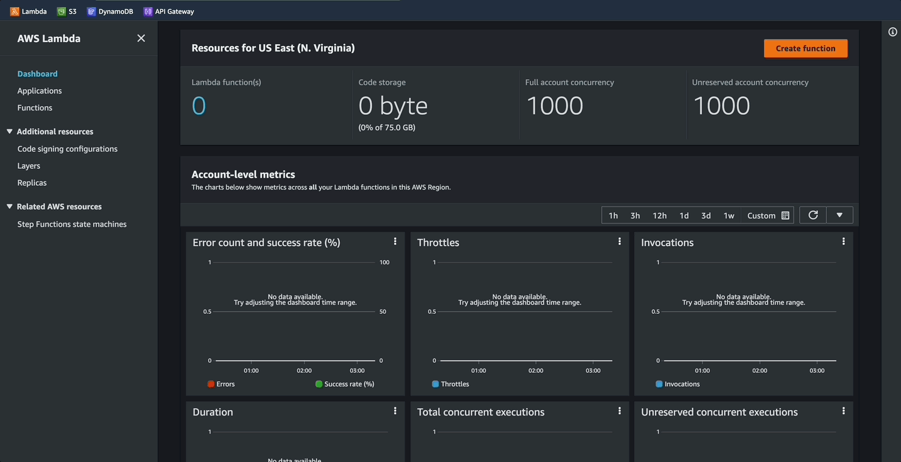
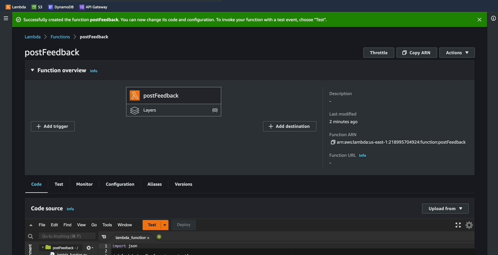
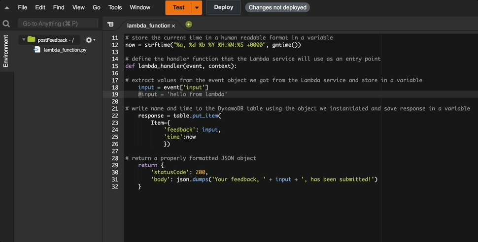
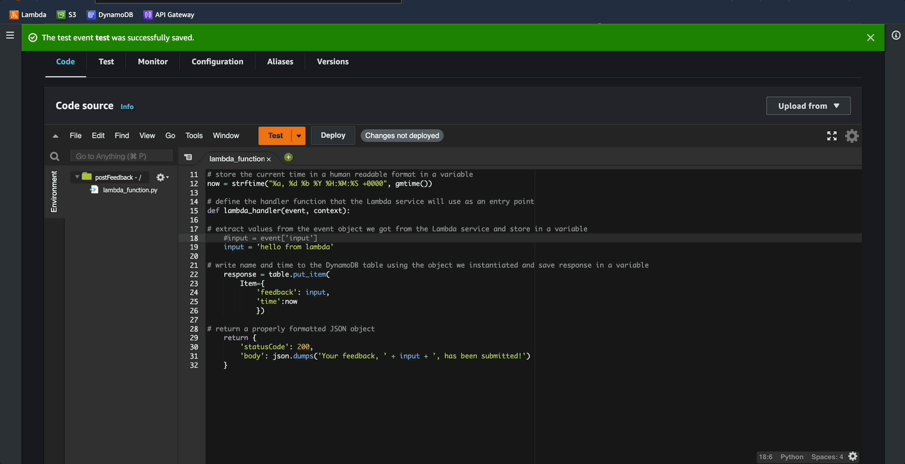
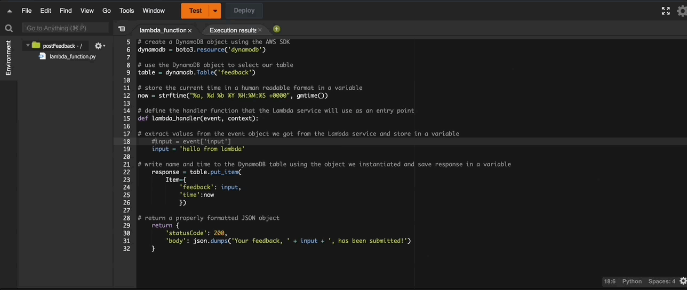
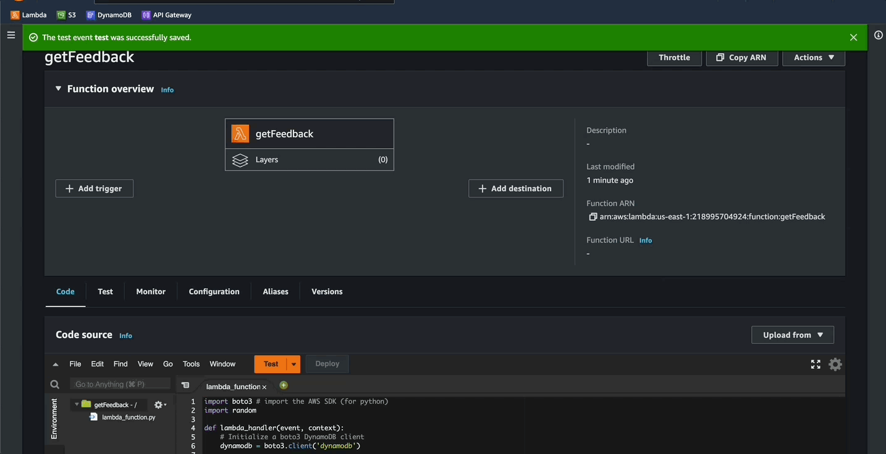

# Create lamda functions

## AWS Lambda
- A serverless, event-driven compute service
- Able to run code for virtually any type of application or backend service without provisioning or managing servers.
- In this application `lambda` will be triggered using `API Gateway` 

## Terminonlogy and Concepts
- **Serverless function:** Piece of code that will be executed by a compute service, on demand.
- **Lambda trigger:** The type of event that will make a Lambda (serverless) function run. 

## Required functions
There will be two lambda functions created:
- `postFeedback` to post to the database
- `getFeedback` to get a random feedback item from database

------------------------------------------------------------------------------------------

## Implementation - Creating functions
### Step 01:
- Give the function a name, in this case `postFeedback`
- Use runtime of `python 3.9` or above
- Architecture `x86`

### Step 02:
- Under persmissions, click on `change default execution role`
- This gives the `lambda function` basic access to `dynamoDB`
- Select `create a new role from AWS policy templates`
- Give the role a name
- For the policy search for and select `simple microservice permissions`
- Click `create function`

*Using `simple micoservice permissions` is not best practice; custom services should operate on the policy of least priviledge, giving as few permissions as possible to reduce overhead and maximize privacy and security.*

### Step 03:
- Paste in the python code from `postFeedback` found here [`../lambda/`](../lambda/)

### Step 04:
- Repeat step 1, but use the name `getFeedback`
- Under `change default execution role`, select use existing
- Select the same one created in step 2
- Repeat step 3, `getFeedback` found here [`../lambda/`](../lambda/)

------------------------------------------------------------------------------------------

## Implementation - Testing
### Step 05:
- To begin testing this code open the `postFeedback` function
- Comment out `input = event['input']`
- Uncomment `input = 'hello from lambda'`
- File -> save
- Remember to change this back after we post the function

### Step 06:
- Click on test provide and `event name`, then save

### Step 07:
- Click on the `test` tab
- Click on the orange `test` button
- Execution result should be successful
- This only tests the the code is CAN run, it does not post to the database

### Step 08:
- To run a test that posts to the database, we need to `deploy` it
- Go back to the code tab, and click deploy
- You must deploy each time changes are made to the code

### Step 09:
- Go back to the test tab and run `test` again
- This time the details in execution result will be different
- Open a new tab and go back to `dynamoDB`
- To view the items in the table, click on the table name
- Then the orange button at the top right `explore table items`
- Clicking the `refresh` button will fetch newly added items

### Step 10:
- Uncomment `input = event['input']`
- Comment out `input = 'hello from lambda'`
- This reverses the change in step 5

### Step 11:
- To test `getFeedback`, make sure the code is `deployed`
- Repeat step 6
- Click on the `test` tab
- Click on the orange `test` button
- Execution result should be successful 
- The item just posted to the database should be returned

------------------------------------------------------------------------------------------

### Next -> [Create REST API][2.3]
[2.3]: <createRestAPI.md>
