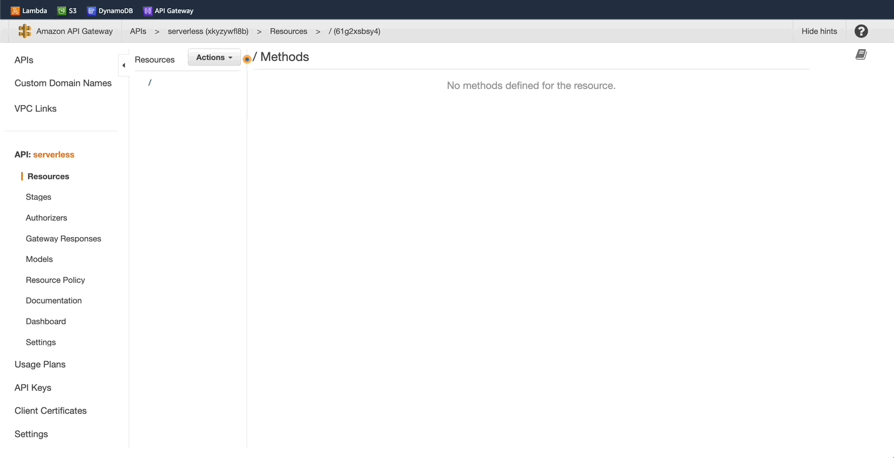
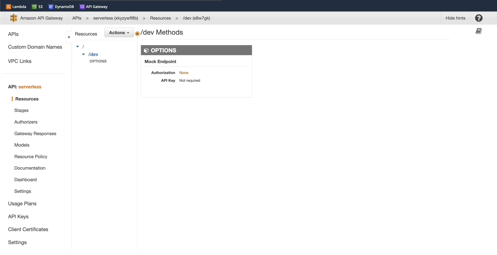
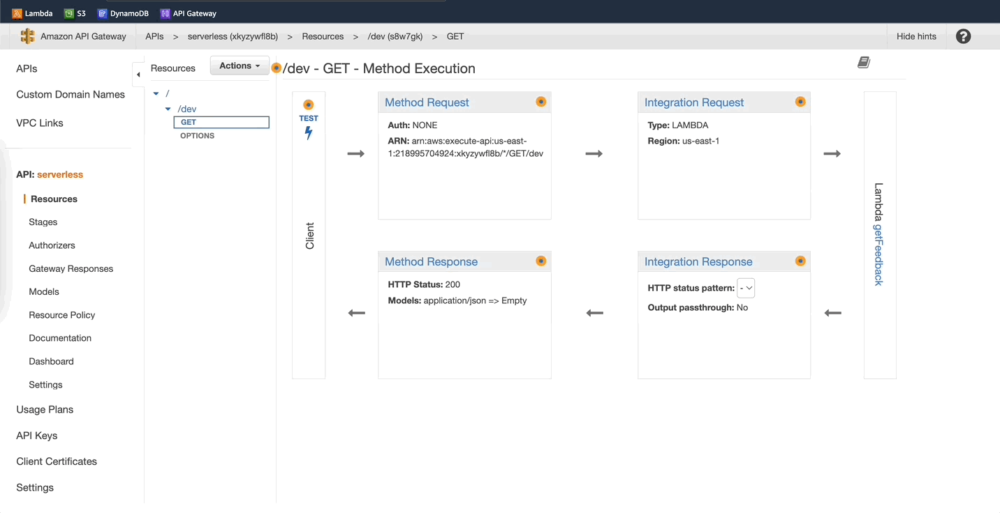

# Create REST API

## Amazon API Gateway 
- Fully managed service that allows creating a REST API that acts as the front-end for other services.
- Using API Gateway provides users with a secure HTTP endpoint to invoke your Lambda function and can help manage large volumes of calls to your function by throttling traffic and automatically validating and authorizing API calls. 
- Will allow the web app to invoke the API

## Terminonlogy and Concepts
- **REST API:** an application programming interface (API or web API) that conforms to the constraints of REST architectural style and allows for interaction with RESTful web services.
- **CORS:** Defines a way for client web app that are loaded in one domain to interact with resources in a different domain.

## REST - Representational State Transfer
- Refers to a group of software architecture design constraints that bring about efficient, reliable and scalable distributed systems.
- Basic idea of REST is that a resource, e.g. a document, is transferred via well-recognized, language-agnostic, and reliably standardized client/server interactions. Services are deemed RESTful when they adhere to these constraints.

## CORS - Cross Origin Resource Sharing
- Is an HTTP-header based mechanism that allows a server to indicate any origins (domain, scheme, or port) other than its own from which a browser should permit loading resources.
- CORS also relies on a mechanism by which browsers make a "preflight" request to the server hosting the cross-origin resource, in order to check that the server will permit the actual request.
- In that preflight, the browser sends headers that indicate the HTTP method and headers that will be used in the actual request.
- An example of a cross-origin request: the front-end JavaScript code served from https://domain-a.com uses XMLHttpRequest to make a request for https://domain-b.com/data.json.
- For security reasons, browsers restrict cross-origin HTTP requests initiated from scripts. 

------------------------------------------------------------------------------------------

## Implementation
### Step 01:
- In API gateway, choose the REST API and select `build`
- Close the prompt and select `new api`
- Name the api, in this case `serverless`
- Click `create`

### Step 02:
- Make sure the the root of the directory you want to add to is selected
- In the actions menu select `create resource`
- Provide a name, in this case `dev`
- `enable` API Gateway CORS
- Create resource

### Step 03:
- Make sure the resource directory `dev` is selected
- In the actions menu select `create method`
- In the dropdown select `GET`
- Apply change by clicking check mark
- Make sure `integration type` is `lambda function`
- Leave `use lambda proxy integration` unchecked
- In the lambda function section, input `getFeedback`
- Click save

### Step 04:
- Select `GET`, then click on `test`
- Results should should a feedback item stored in `dynamoDB`

### Step 05:
- Create the POST request using `postFeedback`

### Step 06:
- To allow the webapp to use the API, CORS must be enabled
- Make sure the `dev` directory is selected
- From actions select `enable cors`
- In methods, deselect `options`
- Click `enable cors and replace existing headers`
- Accept the prompt

### Step 07:
- The API must be deployed to get the `invoke url`
- In actions select `deploy api`
- Select and existing stage or create a new one, in this case `test`
- Click deploy

### Step 08:
- Open the `invoke url` link
- An error message may appear of "Missing authentication token"
- This is because it is looking in the wrong address
- Append `/dev` at the end of the address and load the page
- Feedback item from `dynamoDB` should appear

------------------------------------------------------------------------------------------

### Next -> [Host web app][2.4]
[2.4]: <hostWebApp.md>